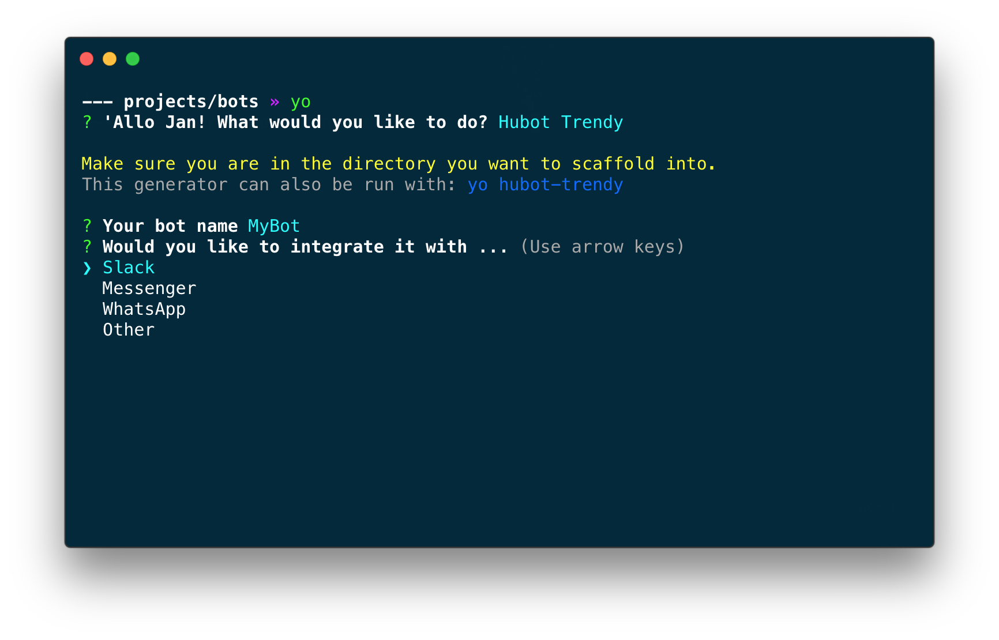

# generator-hubot-trendy

A [Yeoman](http://yeoman.io) generator for creating your own chatbot using the Hubot framework

## Installation

- `npm install -g generator-hubot-trendy`

## Usage

- `yo hubot-trendy`

The code for your bot is in: `./scripts/bot.js`

## Getting Started

See [Hubot's Getting Started
guide](https://github.com/github/hubot/blob/master/docs/index.md) for
details on getting up and running with your very own robot friend.
